## 2017 Spring MLADS Tutorial 159
## Build Machine Learning Solutions in Azure Data Lake with R, Python and Big Cognition

Welcome to this tutorial! This session is be a hands-on lab. Follow the steps here to finish your lab tasks: 

# Prerequisites
To complete this lab you'll need:

- A web browser such as Microsoft Edge, Google Chrome that is able to load the Azure Portal
- Access to an Azure Data Lake Analytics(ADLA) account
- A paper slip with user-specific lab information
- Basic knowledge in Azure Data Lake or Cosmos, R and Python
- Basic knowledge in data science and machine learning

# Getting started

1. Open the address [https://portal.azure.com](http://portal.azure.com) in your webbrowser. 

2. Sign in using the account name and passcode shown in screen, make sure you are logging out your work account. If you log in successfully, you can see on the right corner showing *user1@BigDataDemos.onmicrosoft.com*

	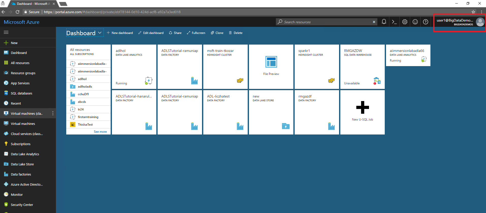

3. In the Search resources box, type in the account info on your slip and click enter.

	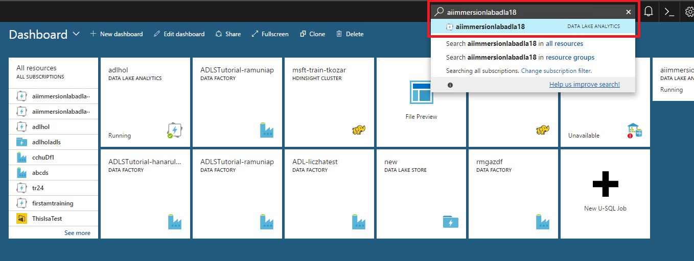

4. Now you are in your own work space. 

	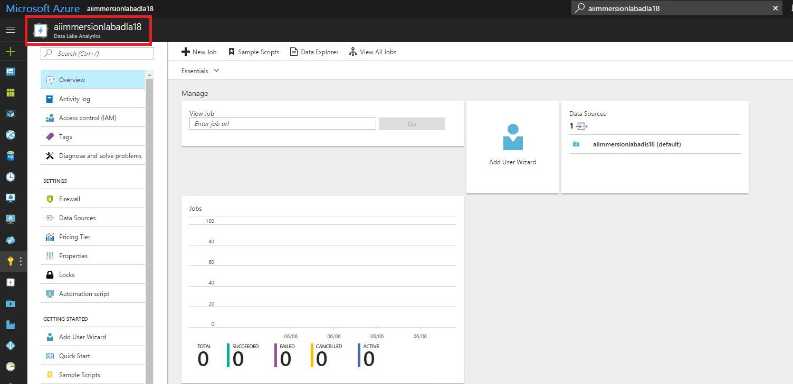

# Warm-up: test drive U-SQL in ADL

There are some sample data and scripts you can play around and get some sense of U-SQL and Azure Data Lake. Click **Sample Scripts**, then click **Copy Sample Data** and **orange buttons** to load sample data as well as extensions to your account.  

 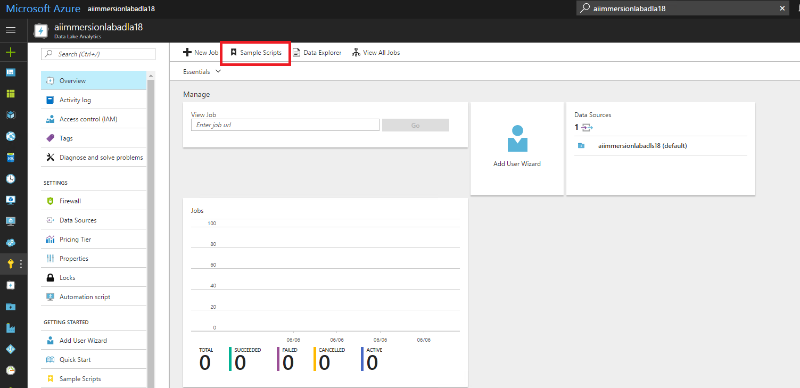

 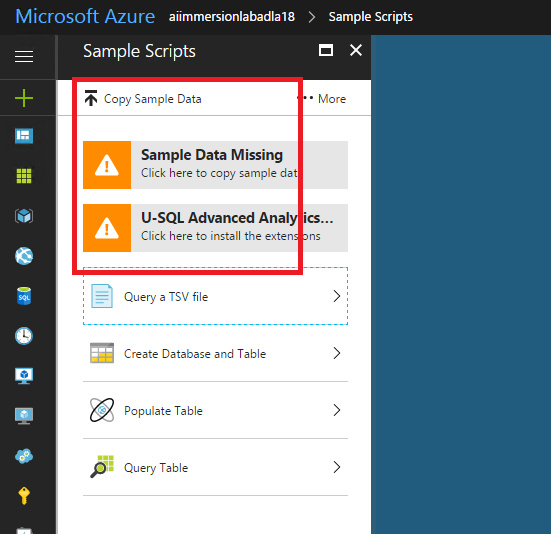

In order to use the R, Python, and Cognition extensions, click **... More** button to install those extensions. 

 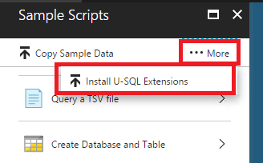

Then a U-SQL job is kicked off to register the assemblies. You can check the status in **View All Jobs**

 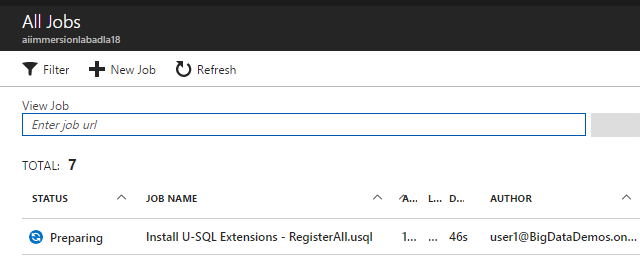

After the job is finished successfully, go to **Data Explorer -->Catalog --> master --> Assemblies**, you will see that a list of extensions are installed.

 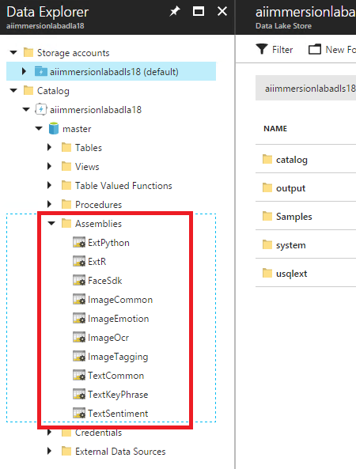

Now you can try some U-SQL queries to get familiar with U-SQL syntax and ADL.

 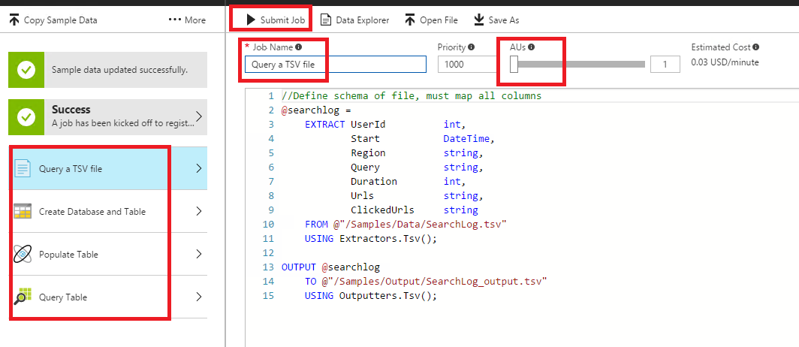

After U-SQL job is submitted, you can track the job status and look at the input/output data sets.

 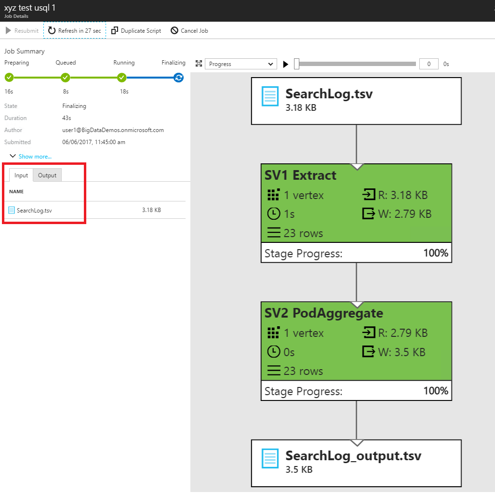

You can always go to View All Jobs to look at submitted jobs, modify scripts and resubmit. To submit another job, click the **+ New job button**. 

 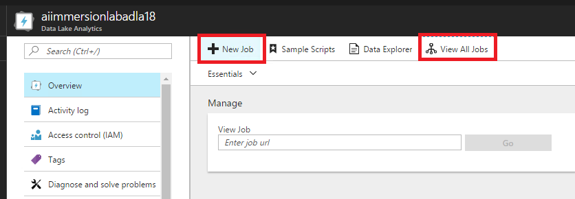

# R in U-SQL

## Exercise 1:

## Exercise 2:

## Exercise 3:

# Python in U-SQL

## Exercise 1:

## Exercise 2:

## Exercise 3:

# Cognitive capabilities in U-SQL

## Exercise 1: Extracting key phrases from the books

In this exercise you will submit a U-SQL script that schematizes the small book set using a custom extractor provided for the lab. The extractor parses each book into several rows containing author and title of the book and book parts that are small enough to fit into a U-SQL `string` typed column. The script then applies the cognitive libraries key phrase extraction processor, aggregates the key phrases into a combined list, and writes the results into an output file.

### Running the script

1. Copy the following U-SQL script into the "New U-SQL Job" window in the portal:

        REFERENCE ASSEMBLY adlhol.master.AIImmersion;
        REFERENCE ASSEMBLY adlhol.master.TextKeyPhrase;

        // Set a String size limit for the string aggregation value. 
        // Since we flow UTF-8, 128kB of Unicode is too big in the general case, so I set it a bit smaller 
        // since I assume we operate on mainly ASCII range characters.
        DECLARE @StringSz = 127 * 1024; 

        @books = 
          EXTRACT author string, title string, bookpart string 
          FROM "adl://adlholadls.azuredatalakestore.net/Samples/Data/Books/Text_Small/{*}.txt"
          USING new AIImmersion.BookExtractor();

        @keyphrases =
          PROCESS @books
          PRODUCE author,
                  title,
                  KeyPhrases string
          READONLY author,
                   title
          USING new Cognition.Text.KeyPhraseExtractor(txtCol : "bookpart", outCol : "KeyPhrases");
    
        @keyphrases =
          SELECT author,
                 title,
                 new string(String.Join(";", ARRAY_AGG(KeyPhrases)).Take(@StringSz).ToArray()) AS keyphrases
          FROM @keyphrases
          GROUP BY author,
                   title;

        OUTPUT @keyphrases
        TO "/output/keyphrases.csv"
        USING Outputters.Csv(outputHeader : true);

2. Select the number of AUs for the job with the slider. Since the job operates on about 30 files, any of the following numbers make sense: 10, 15, 30.

3. To submit your script, click the **Submit Job** button at the top-left of the window.

	

	After a short while, the Job View of the submitted job should appear. 

	

    After some time the Job View will show progress:

	

4. Wait until the job has completed. 

	If the job fails, please look at the **Error** tab and correct the mistake. 

5. Finally check the result by opening the resulting file, by clicking on the "Output" tab and the `keyphrases.csv` filename.

	

	The resulting file should resemble the following:

	
	
This script illustrates the following concepts:

- *Rowset variables*. Each query expression that produces a rowset can be assigned to a variable. Variables in U-SQL follow the T-SQL variable naming pattern of an ampersand (@) followed by a name (such as **@books** in this case). Note that the assignment statement does not execute the query. It merely names the expression and gives you the ability to build-up more complex expressions.

- *The EXTRACT expression*. This gives you the ability to define a schema as part of a read operation. For each column, the schema specifies a paired value consisting of a column name and a C# type name. It uses a so-called extractor, which can be built-in or created by the user. In this case  we are using a user-defined extractor called **AIImmersion.BookExtractor()** that is provided by the U-SQL Assembly **adlhol.master.AIImmersion**.

- *U-SQL file set*. The extractor reads from a file and generates a rowset. If you specify a wild-card pattern in the file name of the EXTRACT expression, then the set of files that match the pattern will be passed to the extractor. In this case the pattern is specified as `adl://adlholadls.azuredatalakestore.net/Samples/Data/Books/Text_Small/{*}.txt` and selects all the files in the specified directory ending with `.txt`.

- *Cross account access*. Both the U-SQL assemblies and the files are stored in different ADLA and ADLS accounts respectively. You can use the ADLA account name and the ADLA database name in that account to reference the U-SQL assembly, assuming you have read permissions. And you can fully qualify the URI for the files, assuming you have access to the store and RX permissions on the folders and files in the path.

- *Cognition library processor*. The `PROCESS` expression applies the cognition library keyphrase extraction processor on each of the book parts. It takes the name of the input column and the name of the output column as arguments. Since the other columns in the rowset are not being processed by the keyphrase extraction processor, they have to be marked as `READ ONLY` so they are passed-through to the result.

- *The OUTPUT statement*. This takes a rowset and serializes it as a comma-separated file into the specified location. Like extractors, outputters can be built-in or created by the user. In this case we are using the built-in **Csv** (comma-separated value) outputter provided by the Outputters class and specify that we want to also output the column names as headers.

## Exercise 2: Using Image Processing OCR

In this exercise, you will use the cognition library's image OCR capability to extract the text from a set of images and apply the keyphrase extraction on it.

### Running the script

1. Copy the following U-SQL script into the "New U-SQL Job" window in the portal:

	    REFERENCE ASSEMBLY adlhol.master.ImageCommon;
        REFERENCE ASSEMBLY adlhol.master.ImageOcr;
        REFERENCE ASSEMBLY adlhol.master.TextKeyPhrase;

        SET @@FeaturePreviews = "FileSetV2Dot5:on";

        @images = 
          EXTRACT filename string, image byte[] 
          FROM "adl://adlholadls.azuredatalakestore.net/Samples/Data/Books/Images/{filename}.jpg" 
          USING new Cognition.Vision.ImageExtractor();

        @ocr =
          PROCESS @images
          PRODUCE filename,
                  ocr_text string
          READONLY filename
          USING new Cognition.Vision.OcrExtractor(imgCol : "image", txtCol : "ocr_text");

        @ocr =
          SELECT filename,
                 ocr_text.Replace('\r', ' ').Replace('\n', ' ') AS ocr_text
          FROM @ocr;

        OUTPUT @ocr
        TO "/output/image_ocr.csv"
        USING Outputters.Csv(outputHeader : true, quoting:true);

        @ocr_keyphrases =
          PROCESS @ocr
          PRODUCE filename,
                  keyphrases string
          READONLY filename
          USING new Cognition.Text.KeyPhraseExtractor(txtCol : "ocr_text", outCol : "keyphrases");

        OUTPUT @ocr_keyphrases
        TO "/output/ocr_keyphrases.csv"
        USING Outputters.Csv(outputHeader : true);
  
2. As before, set the number of Analytics Units (AUs) and submit it. Since we are approximately processing over 900 files, you should use 90 or 100 to get a reasonable scale out.

	

3. As in Exercise 1, wait for the job to complete and verify the results. Note that this job will run for several minutes.

    The successful submission will look like:

	

    As you notice, the job graph is too large for the portal to show. Here is how the job graph looks like in Visual Studio:

	

    The script produces two result files, one containing the OCR extracted text in `image_ocr.csv` and the other containing the keyphrase extraction on it in `ocr_keyphrases.csv`:

	

	

## Exercise 3: Finding potentially related images and books

In this exercise, we will combine the two previous exercises and find potentially related images and books. Instead of reading the books' keyphrases from the files, we will use a predefined table that contains the book authors, titles and their related keyphrases in rows, one row per keyphrase per book and author.

### Running the script

1. Copy the following U-SQL script into the "New U-SQL Job" window in the portal:

        REFERENCE ASSEMBLY adlhol.master.ImageCommon;
        REFERENCE ASSEMBLY adlhol.master.ImageOcr;
        REFERENCE ASSEMBLY adlhol.master.TextKeyPhrase;

        SET @@FeaturePreviews = "FileSetV2Dot5:on";

        @images = 
          EXTRACT filename string, image byte[] 
          FROM "adl://adlholadls.azuredatalakestore.net/Samples/Data/Books/Images/{filename}.jpg" 
          USING new Cognition.Vision.ImageExtractor();

        @ocr =
          PROCESS @images
          PRODUCE filename,
                  ocr_text string
          READONLY filename
          USING new Cognition.Vision.OcrExtractor(imgCol : "image", txtCol : "ocr_text");
     
        @ocr =
          SELECT filename,
                 ocr_text.Replace('\r', ' ').Replace('\n', ' ') AS ocr_text
          FROM @ocr;
    
        @ocr_keyphrases =
          PROCESS @ocr
          PRODUCE filename,
                  keyphrases string
          READONLY filename
          USING new Cognition.Text.KeyPhraseExtractor(txtCol : "ocr_text", outCol : "keyphrases");

        @ocr_keyphrases =
          SELECT filename,
                 keyphrase
          FROM @ocr_keyphrases
               CROSS APPLY
                 EXPLODE(keyphrases.Split(';')) AS K(keyphrase);

        @common =
          SELECT b.title AS book_title,
                 i.filename AS image_title,
                 b.keyphrase
          FROM adlhol.AIImmersion.dbo.BookKeyPhrases AS b
               JOIN
               @ocr_keyphrases AS i
               ON b.keyphrase == i.keyphrase;

        @common_summary =
          SELECT book_title,
                 image_title,
                 String.Join(",", ARRAY_AGG(keyphrase)) AS matches,
                COUNT( * ) AS match_count
          FROM @common
          GROUP BY book_title, image_title;

        OUTPUT @common_summary 
        TO "/output/common_summary.csv"
        ORDER BY match_count DESC
        USING Outputters.Csv(outputHeader : true);

2. As before, set the number of Analytics Units (AUs) and submit it. Since we are approximately processing over 900 files, you should use 90 or 100 to get a reasonable scale out.

	

3. Wait for the job to complete and verify the results. Note that this job will run for several minutes.

    The successful submission will look like:

	

    As you notice, the job graph is too large for the portal to show. Here is how the job graph looks like in Visual Studio:

	

    The script produces a result file that contains for each matching book and image combination the concatenated list of matching keyphrases as well as the count of matches:

	

The above query used a `JOIN` expression. When you work with joins in U-SQL, note that:

- U-SQL only supports the ANSI-compliant JOIN syntax (*Rowset1* JOIN *Rowset2* ON *predicate*). The older syntax (FROM *Rowset1*, *Rowset2* WHERE *predicate*) is not supported.
- The predicate in a JOIN has to be an equality join and no expression. If you want to use an expression, add it to the SELECT clause of a previous rowset. If you want to do a different comparison, you can move it into the WHERE clause. If no predicate is left for the `ON` clause, turn the join into a `CROSS JOIN`. 

U-SQL requires this manual rewrite to make it explicit where the cost is when joining two data sets. Currently only equijoins have more efficient processing than a cross join with filters.

